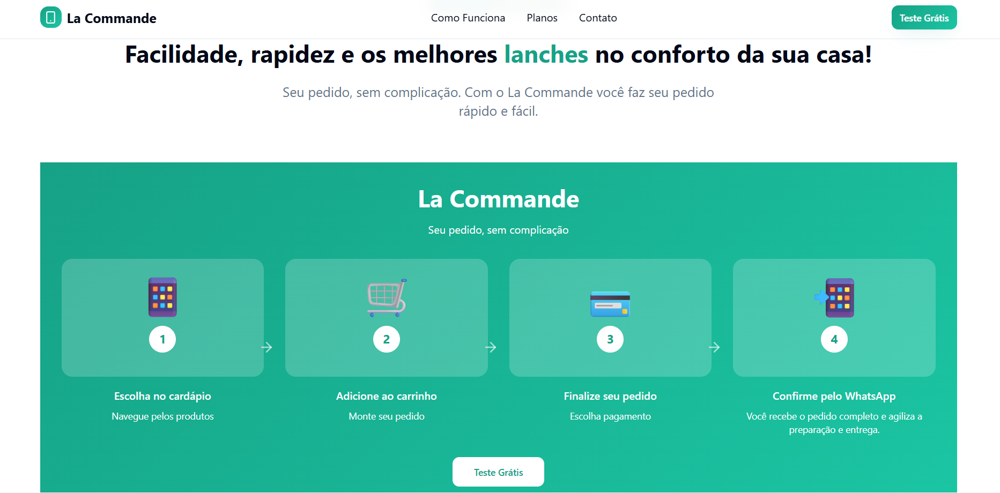

# Landing Page - SaaS Delivery Solution  

Landing page desenvolvida para **captação de assinaturas B2B** da plataforma **La Commande**.  
O objetivo principal é servir como **página de conversão otimizada**, direcionada a **donos de restaurantes** que buscam modernizar e automatizar sua gestão de pedidos.  

---

## 📸 Prévia do Projeto  

  

## 🎯 Objetivo
- Apresentar os benefícios da solução SaaS de delivery.  
- Captar assinaturas através de chamadas estratégicas para ação (CTAs).  
- Facilitar o contato direto com potenciais clientes via formulário e integração com WhatsApp.  

---

## 👥 Público-alvo
Donos de restaurantes e estabelecimentos de alimentação interessados em uma solução prática para gerenciar pedidos e aumentar suas vendas.  

---

## 🛠️ Stack Tecnológica
- **React** 18  
- **Vite** 7.1.3  
- **TailwindCSS** 3.4.17  
- **TypeScript** 5.8.3  

---

## ✨ Funcionalidades
- **Seções principais**:  
  - Hero com chamada para ação (CTA).  
  - Apresentação de planos.  
  - Depoimentos de clientes.  

- **Recursos interativos**:  
  - Formulário de contato.  
  - Integração com WhatsApp para atendimento rápido.  
  - Botões de assinatura direcionados para conversão.  

---

## 🚀 Deploy
O projeto está hospedado no **GitHub Pages**.  

🔗 [Acesse a Landing Page](https://eduardoschoepf.github.io/lacommande-landingpage/)

---

## ⚙️ Como rodar localmente
```bash
# Clone este repositório
git clone https://github.com/seu-usuario/landing-saas-delivery.git

# Acesse a pasta do projeto
cd landing-saas-delivery

# Instale as dependências
npm install

# Rode o projeto em ambiente de desenvolvimento
npm run dev
```

## 📜 Licença

Este projeto é de uso privado.